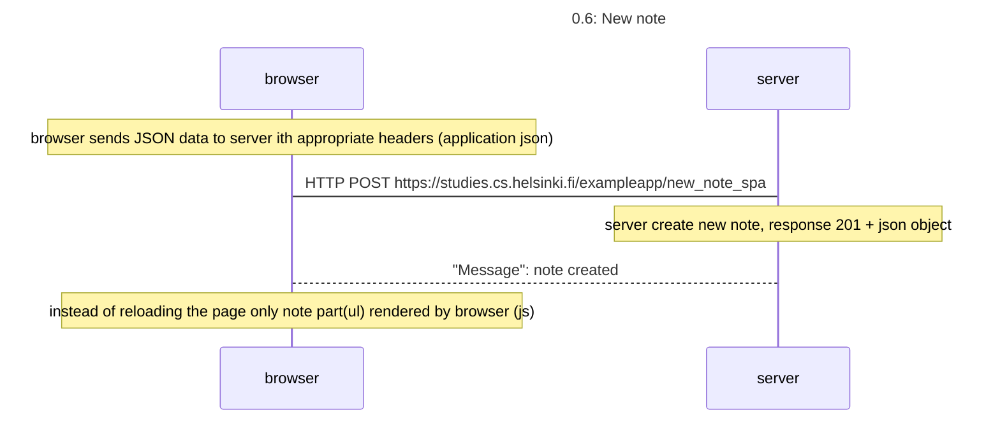

# 0.6: New note

```mermaid
sequenceDiagram
    Title: 0.6: New note

note over browser: browser sends JSON data to server ith appropriate headers (application json)
    browser->server: HTTP POST https://studies.cs.helsinki.fi/exampleapp/new_note_spa
note over server: server create new note, response 201 + json object
    server-->browser: "Message": note created
note over browser: instead of  reloading the page  only note part(ul) rendered by browser (js)


```

